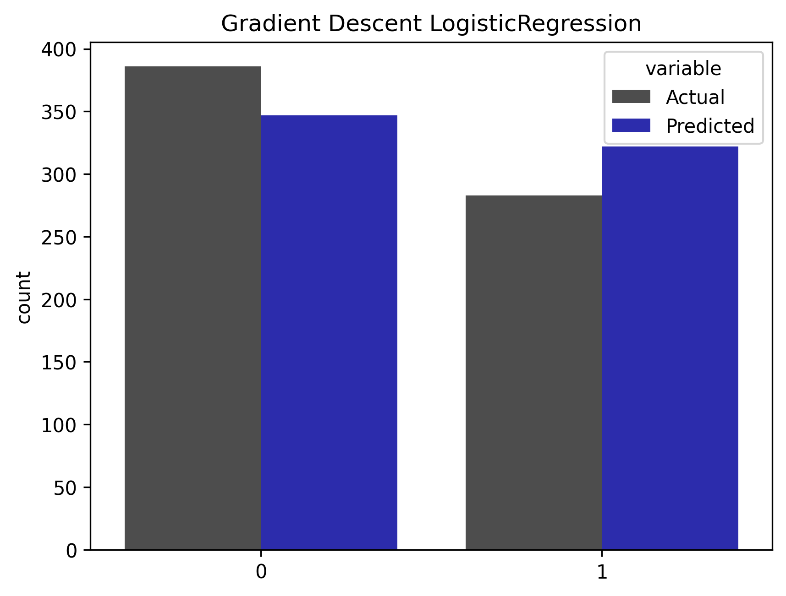
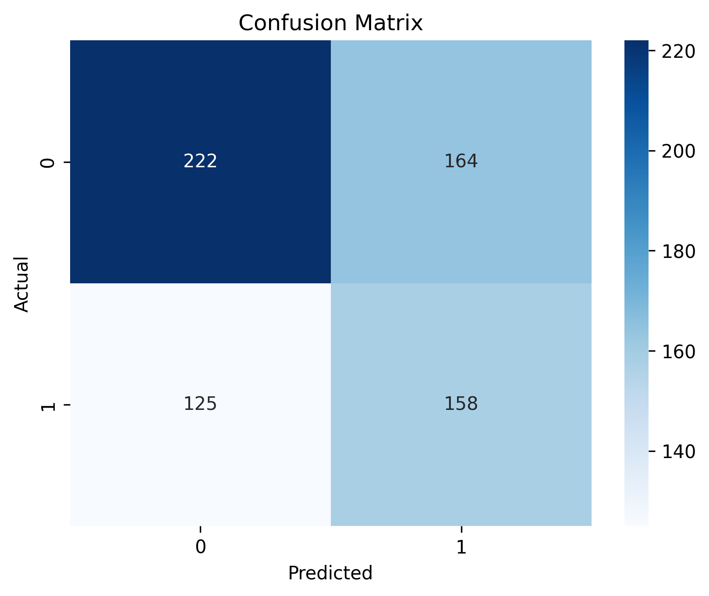

# Tesla Price Prediction Project

- **Part 1 of this project has its own report available (in Czech) in this file: [Report in PDF](r/report.pdf) or [Report in DOCX](r/report.docx)**

This project explores and evaluates different approaches for predicting stock prices using financial time series data. Its main goal is to identify the most effective models and assess their practical performance in trading scenarios.
This project also introduces unusual data - sentiment indicator derived from Elon Musk's tweets from 2010 to 2025 which contains keywords related to "Tesla" company. Elon's tweets can be influential to markets, so sentiment indicated by each tweet related to Tesla might incorporate relevant data to my models. FinBERT model is used to make NLP analysis to get sentiment indicators.

## Project Overview

1. **Analysis framework:**  
   - Analyze a large unique dataset to identify the best-performing models (ARIMA, VAR, basic ML models, etc.).  
   - Incorporate NLP assesed sentiment from Elon's tweets with 4 different levels - positive, negative, neutral or none (Elon didn't tweet about tesla)
   - Dataset also contains survey data representing spread between % of bullish or bearish investors, google trends data of search term "tesla", financial indicators (VIX, TSLA volume, SMA, ATR, stochRSI, MACD, ADX etc.)
   - Evaluate models on prediction accuracy

2. **Prediction Approaches:**  
   - Implementing ARIMA or VAR with exogenous variables for improved accuracy, as pure endogenous approach might be less suitable when some of exogenous indicators (VIX, bulish bearish spread..) do not directly influence the target stock price.  
   - Try alternative basic ML methods to compare them with traditional time series models

### Part 1 (directory r/)
**Unconventional data, conventional models**
- Main programming language: R (python used to get FinBERT from HuggingFace)

- Project evaluates time-series models (ARIMA, ARIMAX, VAR, VARX) on unique data to get answer on hypothesis, that unique Elon Musk's tweets sentiment indicator data, volatility data and market sentiment data bring a lot of information to model predicting financial stock data. 
- I also assume, that usage of more features such as financial indicators would improve accuracy
- Projects uses different model architectures to assess different approaches and compare their evaluation metrics -> their performance.

### Part 2 (directory python/)
**Unconventional data, uncoventional models**
- Main programming language: Python

- Project aims to extend Part 1 of this project. Extension lies in using python instead of R to create machine-learning models and their prediction evaluations. Then compare traditional time-series models and these models to get result of perfomance on financial data.
- Part 2 also explores classification ML methods which cannot be directly compared to regression based models from Part 1
- At the moment there is Gradient Descent Linear Regression and Gradient Descend Logistic Regression done, written from scratch.
- LSTM is planned aswell.

## Tools used
- Python (Pandas, Numpy, SK-learn, Statsmodels, Seaborn, Matplotlib, Transformers - HuggingFace)
- R (Tidyverse, Tidyquant)
- HuggingFace - model FinBERT

- Time series modeling: ARIMA, VAR, ARIMAX, VARX, Gradient descent linear regression, Gradient descent LOGIT.  
- Feature engineering with financial indicators, market and sentiment data. PCA is also used to reduce dimensionality. 

## Outcomes

### ARIMA, ARIMAX, VAR, VARX (Part 1)

**Predictions evaluation across models:**

| Model     | MSE       | RMSE      | MAE       | MASE     |
|-----------|-----------|-----------|-----------|----------|
| **ARIMA** | **0.0014** | **0.0381** | **0.0267** | **0.6823** |
| ARIMAX    | 0.0015    | 0.0383    | 0.0268    | 0.6858   |
| VAR       | 0.0015    | 0.0383    | 0.0271    | 0.6925   |
| VARX      | 0.0015    | 0.0384    | 0.0272    | 0.6962   |
| Naive     | 0.0029    | 0.0540    | 0.0391    | 1.0000   |

- Basic univariate ARIMA model without unique data used in this project beats ARIMAX with this data aswell as multivariate models.
- Every model beats Naive model

### Gradient Descent Linear Regression / Logistic Regression (Part 2)

**Regression:**

| Model                   | MSE        | RMSE       | MAE        | MASE       | R^2        |
|-------------------------|------------|------------|------------|------------|------------|
| **GD LinearRegression** | **0.0014** | **0.0368** | **0.0277** | **0.6765** | **0.0669** |
| Naive                   | 0.0029     | 0.0537     | 0.0410     | 1.0000     | -          |

- Model gets approximately same results as best model from Part 1 (univariate ARIMA)
- R^2 is relatively small (small % of log_return variability explained) which could be anticipated for linear model predicting complex relationships in stock data
- Part 2 uses slightly different indexes of train/test data (train_test_split vs rolling window in Part 1)
- Model beats Naive model 

**Classification:**

| Model                     | Accuracy   | Log Loss   | ROC AUC    |
|---------------------------|------------|------------|------------|
| **GD LogisticRegression** | **0.5680** | **0.6721** | **0.6090** |

- Model shows accuracy slightly better than randomness (0.5)
- Log loss is relatively high, which means weakly calibrated predicted probabilities
- On ROC AUC metric, model shows relatively weak ability to differentiate between classes across different thresholds

### All of these numeric metrics are in line with forecasting difficulty in stock returns and real assumption that, stock price movements are mostly random and can't be reliably predicted based on financial indicators + sentiment signals from tweets doesn't have strong predictive power.

### Predictions in plot:
**Part 1**

**Part 2**

- **NOTE:**  
1 express that log_return is > 0.005 (log return rises atleast by this "significance" threshold) and 0 otherwise (log return is constant or negative)
