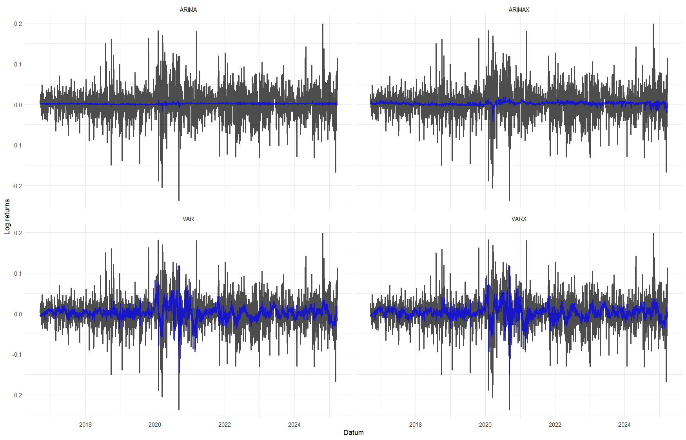

# Tesla Price Prediction Project

- **Part 1 of this project has its own report available (in Czech) in this file: [Report in PDF](r/report.pdf) or [Report in DOCX](r/report.docx)**

- ! PART 2 OF THIS PROJECT IS CURRENTLY IN-PROGRESS - SOME FEATURES AREN'T IMPLEMENTED YET.

This project explores and evaluates different approaches for predicting stock prices using financial time series data. Its main goal is to identify the most effective models and assess their practical performance in trading scenarios.
This project also introduces unusual data - sentiment indicator derived from Elon Musk's tweets from 2010 to 2025 which contains keywords related to "Tesla" company. Elon's tweets can be influential to markets, so sentiment indicated by each tweet related to Telsa might incorporate relevant data to my models. FinBERT model is used to make NLP analysis to get sentiment indicators.

## Project Overview

1. **Model Comparison:**  
   - Analyze a large dataset to identify the best-performing models (ARIMA, VAR, ML regression-based models, etc.).  
   - Evaluate models on prediction accuracy

2. **Prediction Approaches:**  
   - Implementing ARIMA or VAR with exogenous variables for improved accuracy, as pure endogenous approach might be less suitable when exogenous indicators do not directly influence the target price.  
   - Consider potential interactions such as volume and price, which may still influence each other.

### Part 1 (directory r/)
**Unconventional data, conventional models**
- Main programming language: R (python used to get model from HuggingFace)

- Project evaluates time-series models (ARIMA, ARIMAX, VAR, VARX) on unique data to get answer on hypothesis, that unique Elon Musk's tweets sentiment indicator data, volatility data and market sentiment data bring a lot of information to model predicting financial stock data. 
- Projects uses different model architectures to asses different approaches and compare their evaluation metrics -> their performance.

### Part 2 (directory python/)
**Unconventional data, uncoventional models**
- Main programming language: Python

- Project aims to extend Part 1 of this project. Extension lies in using python instead of R to make machine-learning models and their prediction evaluations. Then compare traditional time-series models and these models to get result of perfomance on financial data. At the moment there is Gradient Descent Linear Regression and Gradient Descend Logistic Regression done (written from scratch) and LSTM planned.

## Tools used
- Python (Pandas, Numpy, Statsmodels, Matplotlib, Transformers - HuggingFace)
- R (Tidyverse, Tidyquant)
- HuggingFace - model FinBERT

- Time series modeling: ARIMA, VAR, ARIMAX, VARX, Gradient descent linear regression, Gradient descent LOGIT.  
- Feature engineering with financial indicators, market and sentiment data. PCA is also used to reduce dimensionality. 

## Outcomes

### PART 1 OF THE PROJECT

**Predictions evaluation across models:**

| Model  | MSE       | RMSE      | MAE       | MASE     |
|--------|-----------|-----------|-----------|----------|
| ARIMA  | **0.0014** | **0.0381** | **0.0267** | **0.6823** |
| ARIMAX | 0.0015    | 0.0383    | 0.0268    | 0.6858   |
| VAR    | 0.0015    | 0.0383    | 0.0271    | 0.6925   |
| VARX   | 0.0015    | 0.0384    | 0.0272    | 0.6962   |
| Naive  | 0.0029    | 0.0540    | 0.0391    | 1.0000   |

- Basic univariate ARIMA model without unique data used in this project beats ARIMAX with this data aswell as multivariate models.
- Every model beats Naive model

**Predictions in plot:**

